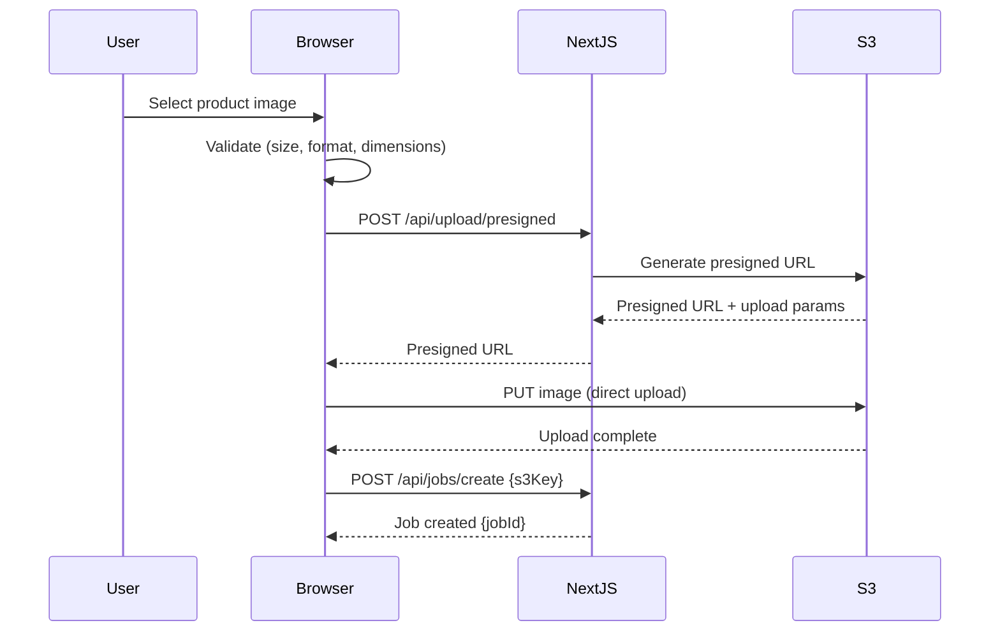
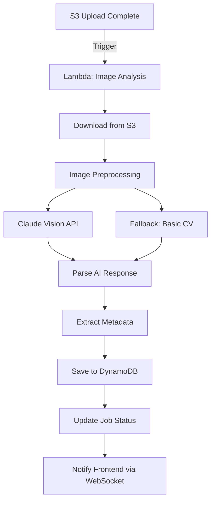
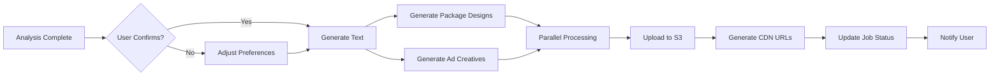
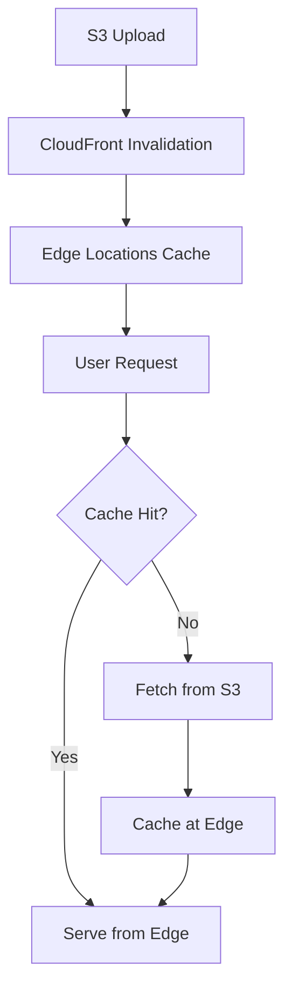
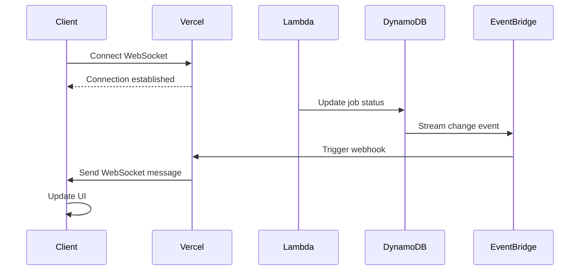
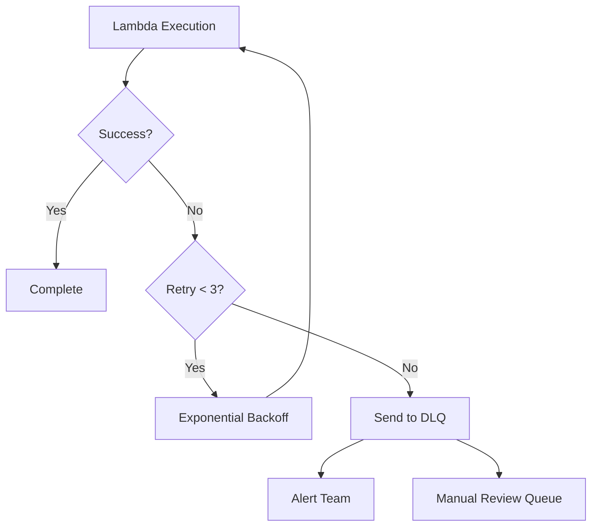

# Data Flow Architecture - Genie AI Marketing Content Generator

## 🌊 Overview

This document describes how data flows through the Genie system from initial image upload to final asset delivery.

## 📤 Upload Flow

### 1. Client-Side Image Upload



#### Client-Side Validation
```typescript
interface UploadValidation {
  maxSize: 10 * 1024 * 1024;        // 10MB
  allowedFormats: ['image/jpeg', 'image/png', 'image/webp'];
  minDimensions: { width: 800, height: 800 };
  maxDimensions: { width: 4096, height: 4096 };
}
```

#### Upload Process
1. **Pre-flight check**: Validate file client-side
2. **Request presigned URL**: POST `/api/upload/presigned`
3. **Direct S3 upload**: Browser → S3 (bypass server)
4. **Job creation**: POST `/api/jobs/create` with S3 key
5. **Webhook trigger**: S3 event → Lambda analysis

### 2. Server-Side Processing

```typescript
// API Route: /api/upload/presigned
export async function POST(request: Request) {
  const { filename, contentType, fileSize } = await request.json();

  // Validate user permissions
  const session = await auth();
  if (!session) return new Response('Unauthorized', { status: 401 });

  // Check rate limits
  const rateLimitOk = await checkRateLimit(session.userId);
  if (!rateLimitOk) return new Response('Rate limit exceeded', { status: 429 });

  // Generate presigned URL
  const key = `uploads/${session.userId}/${Date.now()}-${filename}`;
  const presignedUrl = await s3.getSignedUrl('putObject', {
    Bucket: process.env.S3_BUCKET,
    Key: key,
    ContentType: contentType,
    Expires: 300, // 5 minutes
  });

  return Response.json({ url: presignedUrl, key });
}
```

## 🔍 Analysis Flow

### Image Analysis Pipeline



#### Lambda Function: Image Analysis

```typescript
// lambda/analyze-image.ts
export async function handler(event: S3Event) {
  const { bucket, key } = event.Records[0].s3;

  // 1. Download image from S3
  const imageBuffer = await s3.getObject({ Bucket: bucket, Key: key }).promise();

  // 2. Preprocess image
  const processed = await preprocessImage(imageBuffer.Body);

  // 3. Call Claude Vision API
  const analysis = await analyzeWithClaude(processed);

  // 4. Enrich with metadata
  const enriched = await enrichAnalysis(analysis);

  // 5. Save to database
  await saveAnalysis(enriched);

  // 6. Trigger next stage
  await triggerContentGeneration(enriched.jobId);

  return { statusCode: 200, body: 'Analysis complete' };
}
```

#### Claude Vision API Call

```typescript
async function analyzeWithClaude(imageBuffer: Buffer): Promise<ProductAnalysis> {
  const base64Image = imageBuffer.toString('base64');

  const response = await anthropic.messages.create({
    model: 'claude-3-5-sonnet-20241022',
    max_tokens: 2048,
    messages: [{
      role: 'user',
      content: [
        {
          type: 'image',
          source: {
            type: 'base64',
            media_type: 'image/jpeg',
            data: base64Image,
          },
        },
        {
          type: 'text',
          text: `Analyze this product image and extract:
          1. Product category and type
          2. Dominant colors (hex codes)
          3. Design style (modern, vintage, minimalist, etc.)
          4. Target audience demographic
          5. Key visual features
          6. Suggested brand personality

          Return as structured JSON.`,
        },
      ],
    }],
  });

  return JSON.parse(response.content[0].text);
}
```

#### Analysis Result Schema

```json
{
  "jobId": "job_abc123",
  "timestamp": "2025-12-13T10:30:00Z",
  "analysis": {
    "product": {
      "category": "beverage",
      "subcategory": "energy-drink",
      "type": "canned-drink"
    },
    "visual": {
      "dominantColors": [
        {"hex": "#FF6B35", "name": "coral-orange", "percentage": 45},
        {"hex": "#004E89", "name": "deep-blue", "percentage": 30},
        {"hex": "#FFFFFF", "name": "white", "percentage": 25}
      ],
      "style": "modern-energetic",
      "mood": "dynamic-bold"
    },
    "branding": {
      "targetAudience": {
        "ageRange": "18-35",
        "demographics": ["young-professionals", "athletes", "students"],
        "psychographics": ["achievement-oriented", "health-conscious"]
      },
      "personality": ["energetic", "confident", "modern", "adventurous"],
      "tone": "motivational-upbeat"
    },
    "features": {
      "packaging": "slim-can",
      "finish": "matte",
      "textVisibility": "high-contrast",
      "uniqueElements": ["geometric-patterns", "gradient-effects"]
    },
    "confidence": 0.89
  }
}
```

## 🎨 Content Generation Flow

### Multi-Stage Generation Pipeline



### Text Generation Service

```typescript
// lambda/generate-content.ts
interface ContentGenerationRequest {
  jobId: string;
  analysis: ProductAnalysis;
  preferences: {
    language: string;
    tone: 'professional' | 'casual' | 'playful';
    platforms: ('ec' | 'facebook' | 'instagram' | 'google-ads')[];
    targetLength: 'short' | 'medium' | 'long';
  };
}

async function generateContent(req: ContentGenerationRequest) {
  const { analysis, preferences } = req;

  // 1. Build context-aware prompt
  const prompt = buildContentPrompt(analysis, preferences);

  // 2. Call Claude API for text generation
  const content = await generateWithClaude(prompt, preferences);

  // 3. Generate platform-specific variations
  const variations = await generateVariations(content, preferences.platforms);

  // 4. SEO optimization
  const optimized = await optimizeForSEO(variations, analysis);

  return optimized;
}
```

#### Claude Content Generation Prompt

```typescript
function buildContentPrompt(
  analysis: ProductAnalysis,
  preferences: ContentPreferences
): string {
  return `
You are an expert marketing copywriter. Create compelling product content based on this analysis:

PRODUCT ANALYSIS:
${JSON.stringify(analysis, null, 2)}

TARGET PLATFORMS: ${preferences.platforms.join(', ')}
TONE: ${preferences.tone}
LANGUAGE: ${preferences.language}

Generate the following content:

1. E-COMMERCE DESCRIPTION
   - Short (150 chars): Attention-grabbing headline
   - Medium (500 chars): Feature-focused description
   - Long (1000 chars): Full product story with benefits

2. SOCIAL MEDIA COPY
   - Facebook: Engaging post with emotional appeal
   - Instagram: Visual-first caption with emojis
   - LinkedIn: Professional product announcement

3. AD COPY
   - Google Ads Headline (30 chars)
   - Google Ads Description (90 chars)
   - Facebook Ad Primary Text (125 chars)

4. SEO ELEMENTS
   - Primary keywords (5-7)
   - Long-tail keywords (10-15)
   - Hashtags (10-15)

Return as structured JSON matching this schema:
{
  "ecDescription": { "short": "", "medium": "", "long": "" },
  "socialMedia": { "facebook": "", "instagram": "", "linkedin": "" },
  "adCopy": { "googleAdsHeadline": "", "googleAdsDescription": "", "facebookAd": "" },
  "seo": { "primaryKeywords": [], "longTailKeywords": [], "hashtags": [] }
}
`;
}
```

### Image Generation Service

```typescript
// lambda/generate-images.ts
async function generateImages(
  jobId: string,
  analysis: ProductAnalysis,
  preferences: ImagePreferences
) {
  const tasks = [
    generatePackageDesigns(analysis, preferences),
    generateAdCreatives(analysis, preferences),
  ];

  // Parallel execution
  const [packages, ads] = await Promise.all(tasks);

  // Upload to S3
  const uploadTasks = [
    ...packages.map(img => uploadToS3(img, `${jobId}/package`)),
    ...ads.map(img => uploadToS3(img, `${jobId}/ads`)),
  ];

  const urls = await Promise.all(uploadTasks);

  return { packages: urls.slice(0, packages.length), ads: urls.slice(packages.length) };
}
```

#### DALL-E 3 Integration

```typescript
async function generatePackageDesigns(
  analysis: ProductAnalysis,
  preferences: ImagePreferences
): Promise<Buffer[]> {
  const basePrompt = buildImagePrompt(analysis);

  const variations = [
    `${basePrompt} - Modern minimalist design with clean lines`,
    `${basePrompt} - Bold vibrant design with dynamic elements`,
    `${basePrompt} - Premium elegant design with luxury feel`,
  ];

  const images = await Promise.all(
    variations.map(prompt =>
      openai.images.generate({
        model: 'dall-e-3',
        prompt,
        size: '1024x1024',
        quality: 'hd',
        n: 1,
      })
    )
  );

  // Download and convert to Buffer
  const buffers = await Promise.all(
    images.map(img => downloadImage(img.data[0].url))
  );

  return buffers;
}

function buildImagePrompt(analysis: ProductAnalysis): string {
  const { product, visual, branding } = analysis;

  return `
Professional product packaging design for ${product.category}.
Style: ${visual.style}
Colors: ${visual.dominantColors.map(c => c.name).join(', ')}
Mood: ${visual.mood}
Target audience: ${branding.targetAudience.demographics.join(', ')}
Features: ${product.type}, ${visual.finish} finish
Design elements: ${analysis.features.uniqueElements.join(', ')}

Requirements:
- High-quality commercial photography style
- Clean background
- Professional lighting
- Product-focused composition
- Marketing-ready asset
`;
}
```

## 💾 Storage Flow

### S3 Bucket Structure

```
genie-assets-prod/
├── uploads/
│   └── {userId}/
│       └── {timestamp}-{filename}
│
├── generated/
│   └── {jobId}/
│       ├── analysis.json
│       ├── content.json
│       ├── packages/
│       │   ├── modern-v1.png
│       │   ├── bold-v2.png
│       │   └── premium-v3.png
│       └── ads/
│           ├── facebook-1080x1080.png
│           ├── instagram-1080x1080.png
│           └── google-1200x628.png
│
└── thumbnails/
    └── {jobId}/
        └── {assetId}-thumb.webp
```

### CDN Distribution



#### CloudFront Configuration

```typescript
const cloudFrontConfig = {
  origins: [{
    id: 'S3-genie-assets',
    domainName: 'genie-assets-prod.s3.amazonaws.com',
  }],
  defaultCacheBehavior: {
    targetOriginId: 'S3-genie-assets',
    viewerProtocolPolicy: 'redirect-to-https',
    compress: true,
    cachePolicyId: 'Managed-CachingOptimized',
  },
  customErrorResponses: [
    { errorCode: 404, responseCode: 200, responsePage: '/404.html' },
  ],
  priceClass: 'PriceClass_100', // US, Europe, Asia
};
```

## 🔄 Real-time Updates Flow

### WebSocket Event Stream



#### WebSocket Message Format

```typescript
type WebSocketMessage =
  | { type: 'job.created', payload: { jobId: string } }
  | { type: 'job.analyzing', payload: { jobId: string, progress: number } }
  | { type: 'job.analysis_complete', payload: { jobId: string, analysis: ProductAnalysis } }
  | { type: 'job.generating', payload: { jobId: string, stage: string, progress: number } }
  | { type: 'job.complete', payload: { jobId: string, assets: GeneratedAssets } }
  | { type: 'job.error', payload: { jobId: string, error: string } };
```

#### Client-Side Handler

```typescript
// app/hooks/useJobStatus.ts
export function useJobStatus(jobId: string) {
  const [status, setStatus] = useState<JobStatus>('pending');
  const [progress, setProgress] = useState(0);
  const [result, setResult] = useState<GeneratedAssets | null>(null);

  useEffect(() => {
    const ws = new WebSocket(`${WS_URL}?jobId=${jobId}`);

    ws.onmessage = (event) => {
      const message: WebSocketMessage = JSON.parse(event.data);

      switch (message.type) {
        case 'job.analyzing':
          setStatus('analyzing');
          setProgress(message.payload.progress);
          break;
        case 'job.generating':
          setStatus('generating');
          setProgress(50 + message.payload.progress / 2);
          break;
        case 'job.complete':
          setStatus('complete');
          setProgress(100);
          setResult(message.payload.assets);
          break;
        case 'job.error':
          setStatus('error');
          toast.error(message.payload.error);
          break;
      }
    };

    return () => ws.close();
  }, [jobId]);

  return { status, progress, result };
}
```

## 📊 Database Flow

### DynamoDB Schema

```typescript
// Table: Jobs
interface JobRecord {
  PK: `JOB#${string}`;           // Partition key
  SK: `META#${string}`;          // Sort key
  userId: string;
  status: JobStatus;
  originalImage: string;
  createdAt: string;             // ISO timestamp
  updatedAt: string;
  GSI1PK: `USER#${string}`;      // For user queries
  GSI1SK: `JOB#${string}`;
}

// Table: Assets
interface AssetRecord {
  PK: `JOB#${string}`;
  SK: `ASSET#${string}`;
  type: 'package' | 'ad' | 'content';
  url: string;
  metadata: Record<string, any>;
  createdAt: string;
}
```

### Query Patterns

```typescript
// 1. Get job by ID
const job = await dynamodb.get({
  TableName: 'Jobs',
  Key: { PK: `JOB#${jobId}`, SK: 'META' },
});

// 2. Get user's recent jobs
const userJobs = await dynamodb.query({
  TableName: 'Jobs',
  IndexName: 'GSI1',
  KeyConditionExpression: 'GSI1PK = :userId AND begins_with(GSI1SK, :prefix)',
  ExpressionAttributeValues: {
    ':userId': `USER#${userId}`,
    ':prefix': 'JOB#',
  },
  ScanIndexForward: false,
  Limit: 20,
});

// 3. Get all assets for a job
const assets = await dynamodb.query({
  TableName: 'Jobs',
  KeyConditionExpression: 'PK = :jobId AND begins_with(SK, :prefix)',
  ExpressionAttributeValues: {
    ':jobId': `JOB#${jobId}`,
    ':prefix': 'ASSET#',
  },
});
```

## 🔁 Error Handling & Retry Flow

### Retry Strategy

```typescript
interface RetryConfig {
  maxAttempts: 3;
  backoffMultiplier: 2;
  initialDelayMs: 1000;
}

async function withRetry<T>(
  fn: () => Promise<T>,
  config: RetryConfig = defaultRetryConfig
): Promise<T> {
  let lastError: Error;

  for (let attempt = 1; attempt <= config.maxAttempts; attempt++) {
    try {
      return await fn();
    } catch (error) {
      lastError = error;

      if (attempt === config.maxAttempts) break;

      const delay = config.initialDelayMs * Math.pow(config.backoffMultiplier, attempt - 1);
      await sleep(delay);
    }
  }

  throw lastError;
}
```

### Dead Letter Queue (DLQ)



---

**Last Updated**: 2025-12-13
**Version**: 1.0
**Owner**: Engineering Team
